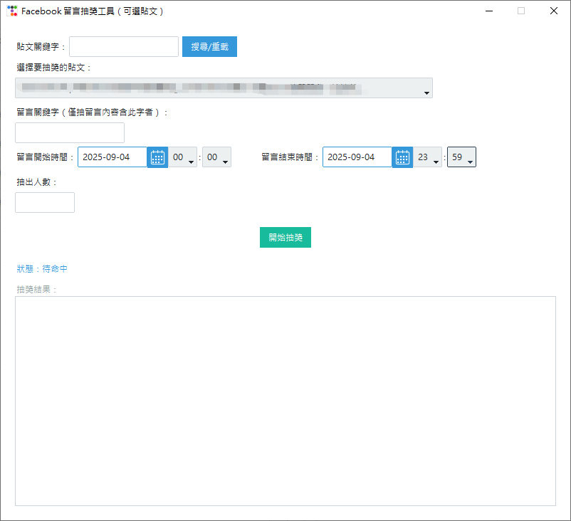

# Facebook 留言抽獎工具（ttkbootstrap 美化版）

## 特色

- 支援 Facebook 粉專/個人貼文留言全自動抓取
- 可依留言關鍵字、留言時間區間過濾
- 時間選擇器穩定美觀（ttkbootstrap.DateEntry）
- 支援抽出多位中獎者，結果可直接複製到 Excel
- 介面現代化、操作簡單

## 使用方式

1. 安裝 Python 3.8+，建議 3.10/3.11
2. 安裝必要套件：
   ```bash
   pip install ttkbootstrap requests
   ```
3. 取得 Facebook Graph API 權杖，請到 [Facebook Graph API Explorer](https://developers.facebook.com/tools/explorer/) 取得，並將權杖填入 `.env` 檔案：
   ```
   ACCESS_TOKEN=你的token
   ```
   程式會自動讀取 `.env`，不會外洩敏感資訊。
4. 執行 `facebookFlow.py`
   ```bash
   python facebookFlow.py
   ```
5. 操作說明：
   - 輸入/搜尋貼文關鍵字，選擇要抽獎的貼文
   - 可設定留言關鍵字、留言時間區間
   - 輸入要抽出的人數，點擊「開始抽獎」
   - 結果區塊可直接複製到 Excel

## 注意事項

- 權杖需有貼文/留言存取權限，建議用粉專長權杖
- 請勿將 `.env` 檔案上傳到 git 或公開空間，已預設加入 `.gitignore`
- 若留言數量龐大，抓取需耐心等待
- 若遇到 Facebook API 限制，請稍後再試

## 介面預覽



---

本專案由 [appskm20049f6](https://github.com/appskm20049f6) 製作，歡迎交流改進！
